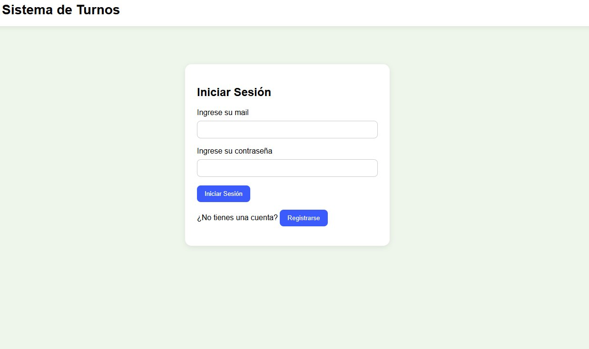
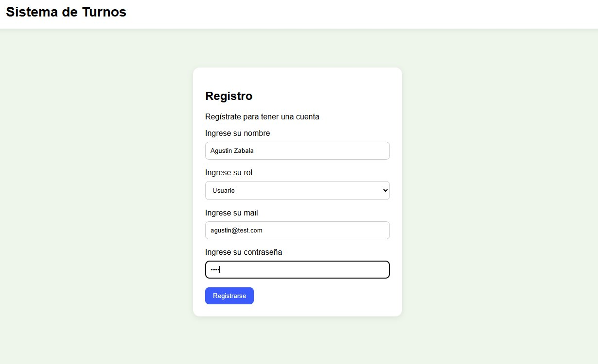
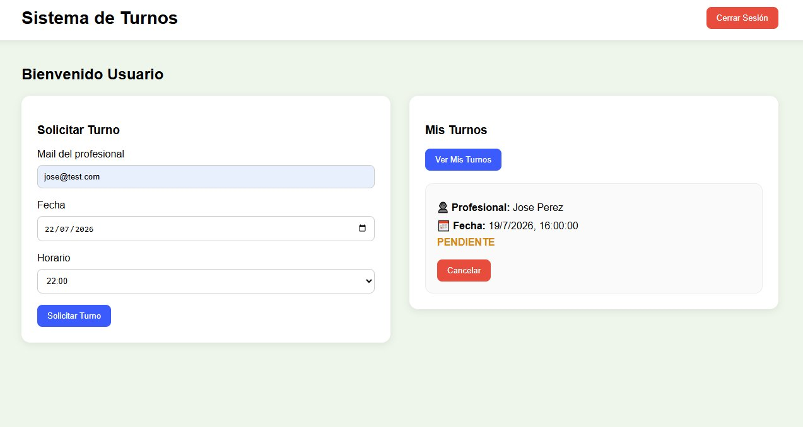
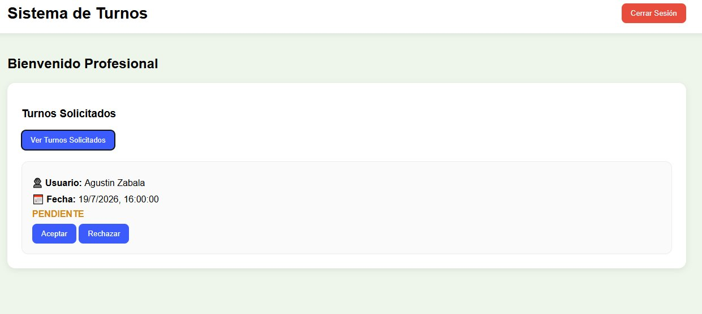

# Sistema de Gestión de Turnos

Aplicación web desarrollada como proyecto personal para gestionar turnos entre usuarios y profesionales.

El sistema permite a los usuarios solicitar turnos con un profesional indicando una fecha y horario determinados, y a su vez el profesional, le llega la solicitud y decide si aceptar o no el turno, todo esto mediante una interfaz web conectada a una API REST desarrollada con Spring Boot.

## Tecnologías utilizadas

- Java 24
- Spring Boot
- Spring Data JPA
- Spring Security
- PostgreSQL
- HTML5
- CSS3
- JavaScript
- Maven

## Funcionalidades

- Registro de usuarios y profesionales.
- Inicio y cierre de sesión.
- Solicitud de turnos.
- Validación de horarios disponibles.
- Prevención de turnos duplicados.
- Validación de fechas pasadas.
- Aceptación o rechazo de solicitudes por parte del profesional.
- Cancelación de turnos por el usuario.
- Marcado de turnos como atendidos.
- Validación de datos tanto en frontend como en backend.
- Encriptación de contraseñas mediante Spring Security.

## Estructura del proyecto

El proyecto está dividido en dos partes:

- **Backend:** desarrollado con Java y Spring Boot. Expone una API REST y gestiona la lógica de negocio, la autenticación y el acceso a la base de datos.

- **Frontend:** desarrollado con HTML, CSS y JavaScript. Consume la API mediante peticiones HTTP utilizando Fetch API y permite interactuar con el sistema desde el navegador.

## Flujo del sistema

1. El usuario se registra.
2. Inicia sesión.
3. Solicita un turno indicando el profesional, la fecha y el horario.
4. El profesional visualiza las solicitudes pendientes.
5. El profesional puede aceptar o rechazar la solicitud.
6. Una vez aceptado el turno, el profesional puede marcarlo como atendido.
7. El usuario puede cancelar un turno pendiente.

## Capturas

### Inicio de sesión

### Registro

### Vista del usuario

### Vista del profesional

## Instalación y ejecución

### Requisitos

- Java 24
- Maven
- PostgreSQL
- Git

### Backend

1. Clonar el repositorio.
2. Ingresar a la carpeta `backend`.
3. Configurar la base de datos en `application.properties`.
4. Ejecutar la aplicación desde IntelliJ IDEA o mediante Maven.

### Frontend

1. Ingresar a la carpeta `frontend`.
2. Abrir el archivo `index.html` con un navegador web.

## Autor

Desarrollado por Agustín Zabala como proyecto personal para practicar el desarrollo Full Stack utilizando Spring Boot y JavaScript.